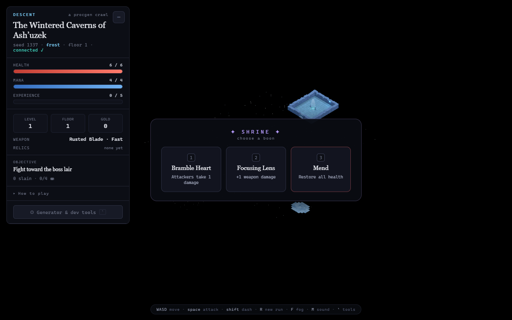

# ⚔️ Descent

**A floor-diving action roguelite built on top of [Dungeon Forge](#-credits) — a deterministic procedural dungeon generator.**

Every floor is a freshly generated dungeon. Explore through the fog, fight from the entrance to the boss lair with weapons that feel different and a dodge-dash that grants brief invulnerability, spend the boons you find at shrines, best a multi-phase boss, and step into the portal to descend deeper — harder each time. Die and the run is over. Rendered live with [Three.js](https://threejs.org/); every sound effect is synthesized at runtime; nothing is loaded from disk.



---

## ▶ Play locally

```bash
npm install
npm run dev        # then open http://localhost:5173
```

Let the dungeon build itself (or press **Space** to skip the animation), then **WASD** to move. Press **`` ` ``** any time to open the generator / dev drawer.

Other scripts:

```bash
npm run build          # production build
npm run preview        # serve the build
npm run demo:headless  # pure-Node generator demo + determinism/regression checks
```

## 🎮 Controls

| Action | Key |
| --- | --- |
| Move | **W A S D** |
| Attack | **Space** |
| Dash / dodge (spends mana, brief i-frames) | **Shift** |
| Choose a shrine boon | **1 · 2 · 3** |
| New run | **R** |
| Toggle fog / sound | **F** / **M** |
| Pan · zoom · orbit camera | drag · wheel · right-drag |
| Generator & dev tools | **`` ` ``** |

## ✨ Features

- **Endless, deterministic floors.** Each floor is a generated dungeon with its own name and theme; per-floor seeds are derived from the run seed, so a whole run is reproducible.
- **Fog of war** — permanent reveal-on-explore, room and corridor based.
- **Three weapons with distinct feel** — a fast blade, a heavy knockback hammer, and a ranged mana-fueled wand (with projectiles).
- **Dash** with invulnerability frames that dodge both blows and bolts.
- **Three enemy archetypes** — grunts that swarm, casters that kite and snipe, chargers that telegraph then dash — plus a **multi-phase boss with a health bar** (stalk → ranged volleys → radial bursts).
- **Progression** — descend through the boss portal carrying your character; difficulty scales with depth; death ends the run and shows a summary.
- **Relics & interactive shrines** — 8 stacking passive boons (lifesteal, thorns, +damage, faster dash, and more), chosen at shrines built into the generator's shrine rooms.
- **Character-sheet HUD** — health, mana, XP/level, gold, weapon, relics, and a live objective. The generator's controls live one keystroke away in a dev drawer.
- **Procedural audio** — every sound is built from oscillators and filtered noise via the Web Audio API at runtime; no audio files.

## 🗂 Project layout

- **`src/gen/dungeon.js`** — the procedural generator, extracted as a **pure, engine-agnostic module** (zero imports, runs in plain Node). This is the reusable core: scatter → separate → Delaunay → MST + loops → semantics → carve → decorate, all threaded through one seeded PRNG.
- **`src/game/*.js`** — the game systems layered on top: `state` (run/character), `player`, `enemies`, `loot`, `shrines`, `relics`, `weapons`, `fog`, `audio`.
- **`src/main.js`** — the Three.js renderer, post-processing, and the game loop that wires it all together.
- **`scripts/headless-demo.js`** — a pure-Node demo that prints an ASCII map and asserts determinism + pinned regression values (`npm run demo:headless`).

## 🙏 Credits

Built on **Dungeon Forge** by **[@majidmanzarpour](https://github.com/majidmanzarpour)** ([live demo](https://procedural-dungeon.netlify.app)) — the deterministic procedural dungeon generator and its painterly Three.js renderer, themes, props, liquids, lights, and particles are his work. Descent adds the game on top: player, combat, enemies, progression, relics, shrines, UI, and audio.

## 📄 License

MIT — see [`LICENSE`](LICENSE). Original generator © Majid Manzarpour.
